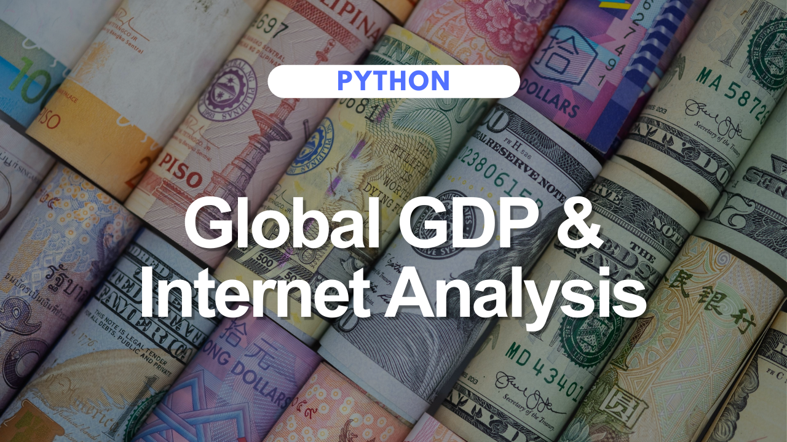

# Global GDP & Internet Analysis

[Click here to view the Jupyter Notebook.](https://github.com/jessicabohannon/UN-Global-GDP-Internet-Analysis/blob/main/UN_Data_Project.ipynb)

## Project Overview
The Global GDP & Internet Analysis project offers a comprehensive exploration of the relationship between internet connectivity and economic prosperity worldwide. Leveraging datasets provided by the United Nations, the analysis aims to uncover insights into the developmental trajectories of nations, shedding light on the interplay between economic strength and digital adoption.

## Skills Showcased
* **Advanced Data Manipulation:** Utilized Python's Pandas library for data manipulation tasks, including cleaning, merging, and transforming datasets to facilitate analysis.
* **Exploratory Data Analysis (EDA):** Applied EDA techniques to uncover patterns, trends, and anomalies within the datasets, providing valuable insights into global economic and technological dynamics.
* **Data Visualization:** Utilized Matplotlib and Seaborn libraries to create informative visualizations, effectively communicating key findings and trends to stakeholders.
* **Statistical Analysis:** Performed statistical analysis to identify correlations and relationships between GDP, internet usage, and other socio-economic indicators, enhancing understanding of global development trends.
* **Merging and Integration:** Demonstrated proficiency in merging and integrating diverse datasets, facilitating comprehensive analysis and exploration of multidimensional relationships.
* **Strategic Insights:** Provided data-driven insights and recommendations that could assist policymakers, researchers, and educators in making informed decisions related to economic development and digital infrastructure.

## Conclusion
The Global GDP & Internet Analysis project demonstrates advanced skills in data manipulation, exploratory data analysis, and data visualization, applied to uncover insights into the complex dynamics of global economic development and digital adoption. By leveraging Python's versatile libraries and techniques, the analysis provides valuable insights that contribute to a deeper understanding of the evolving landscape of global prosperity and connectivity
